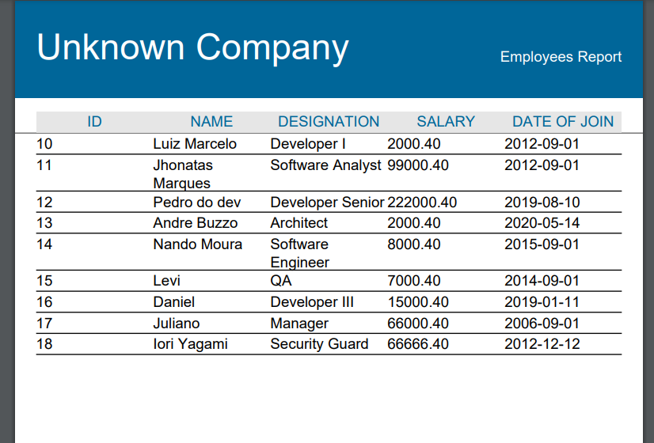

# Jasper Reports simple use example.
Just run the application and go into your browser on http://localhost:8080/report/employee and get the report.
### 🛠 Technologies
- Spring Boot
- H2
- Jasper Reports

### 
Report genarated on below

 
 

  

